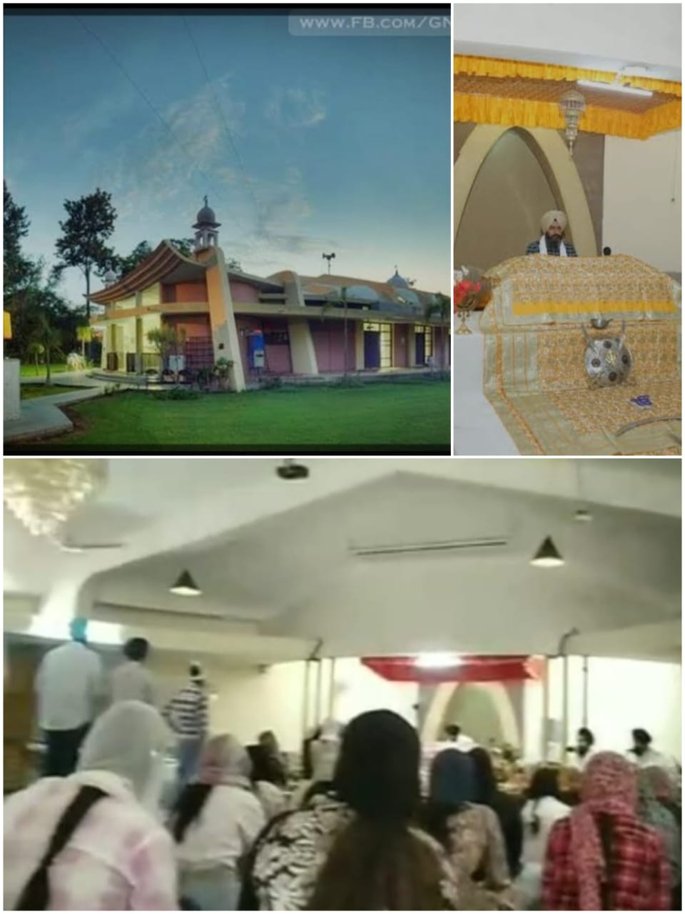

# Daman-05.github.io

# About me

I am Damanpreet Kaur.I am from gill ludhiana.I am persuing BTECH in computer science engineering at GNDEC Ludhiana.

# My 12th Marks 

|subjects| obtained Mark|
|----------|----------|
|Maths| 95|
|Chemistry| 83|
Physics| 64|
|English| 77|
|Punjabi| 79|
# My hobbies 
- Photography 
- video's & photos editing 

# My Excel certificate 

I recently completed an MS Excel course through www.mygreatLearning.com , and it has been a highly great experience. It offers a wide range of tools for data management, analysis, and visualization. Some of the key features of Excel include:

1. _Data entry and storage_: Enter and store data in a table format.
2. _Formulas and calculations_: Perform calculations using formulas and functions.
3. _Data analysis_: Analyze data using tools like pivot tables, charts, and statistical functions.
4. _Data visualization_: Create charts, graphs, and other visualizations to represent data.
5. _Conditional formatting_: Highlight important data using conditional formatting rules.
6. _Data manipulation_: Sort, filter, and manipulate data to extract insights.
7.     - Macros*: Automate tasks using Visual Basic for Applications (VBA) macros.
8. _Collaboration_: Share and collaborate on workbooks with others in real-time.

Some common uses of Excel include:

1. _Budgeting and financial planning_
2. _Data analysis and reporting_
3. _Charting and graphing_
4. _Database management_
5. _Scientific and engineering calculations_
6. _Business intelligence and analytics_
7. _Education and research_

# Induction program 2024

I am glad to share my thoughts and experience about induction program which was conducted by  college from last two weeks.

# First day at GNDEC 

On first day at morning students of specific department gathered first at gurudwara sahib inside the college. It was very peaceful inside gurudwara sahib.I prayed to god that my engineering journey become memorable and successful for me.

At auditorium Pr. Dr. Sehijpal Singh,NSET Dir. S. Inderpal Singh  welcomed us to the beautiful GNDEC campus, introducing us to its stunning surroundings. The chief guest was also warmly received. Together, we explored the vibrant and inspiring environment of the college.

# Er.Jiwandeep singh

Er.Jiwandeep singh ,PCS and alumni of college given very useful tips to us for our 4 year engineering journey.sir told us that Seek out opportunities and seize them. Engage with long-form content to deepen your knowledge. Identify your passion as soon as possible.

# SSP Rajeshwar singh 

sir inspired us with his past stories.sir encouraged us to embrace essential phrases:-
1.I am sorry: which says accept mistakes 
2.Forgive me: which seeks forgiveness.
3.Thank you: which represents gratitude.
4.I love you: which expresses acceptance.

# Second Day experience 

On second day Dr. Arvind Dhingra sir addressed us they explained

types of membership

Member
Active Member
Executive Member
officer bearer
types of societies

National level associated( eg.SCIE,ISTE,SAE)
Department level associated(EG.E2S2)

# Third day at college 

A very humble person Dr.pyare lal garg addressed us Embrace your passions, maintain positivity, and view challenges as opportunities for growth. 
