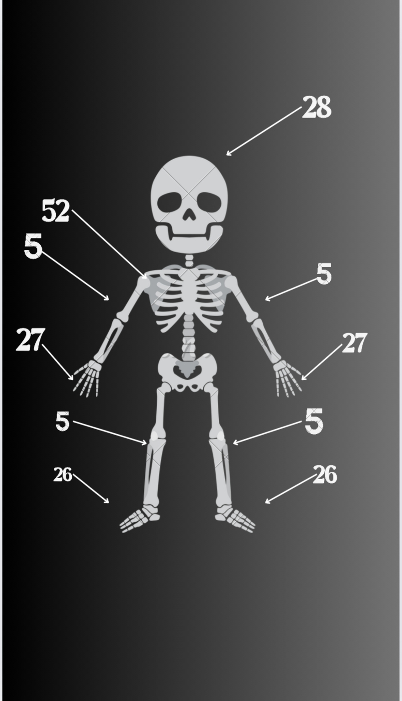

# Daman-05.github.io

# About me

I am Damanpreet Kaur.I am from gill ludhiana.I am persuing BTECH in computer science engineering at GNDEC Ludhiana.

# My 12th Marks 

|subjects| obtained Mark|
|----------|----------|
|Maths| 95|
|Chemistry| 83|
Physics| 64|
|English| 77|
|Punjabi| 79|
# My hobbies 
- Photography 
- video's & photos editing 

# My Excel certificate 

I recently completed an MS Excel course through www.mygreatLearning.com , and it has been a highly great experience. It offers a wide range of tools for data management, analysis, and visualization. Some of the key features of Excel include:

1. _Data entry and storage_: Enter and store data in a table format.
2. _Formulas and calculations_: Perform calculations using formulas and functions.
3. _Data analysis_: Analyze data using tools like pivot tables, charts, and statistical functions.
4. _Data visualization_: Create charts, graphs, and other visualizations to represent data.
5. _Conditional formatting_: Highlight important data using conditional formatting rules.
6. _Data manipulation_: Sort, filter, and manipulate data to extract insights.
7.     - Macros*: Automate tasks using Visual Basic for Applications (VBA) macros.
8. _Collaboration_: Share and collaborate on workbooks with others in real-time.

Some common uses of Excel include:

1. _Budgeting and financial planning_
2. _Data analysis and reporting_
3. _Charting and graphing_
4. _Database management_
5. _Scientific and engineering calculations_
6. _Business intelligence and analytics_
7. _Education and research_

# Induction program 2024

I am glad to share my thoughts and experience about induction program which was conducted by  college from last two weeks.

# 1st day at GNDEC 

On first day at morning students of specific department gathered first at gurudwara sahib inside the college. It was very peaceful inside gurudwara sahib.I prayed to god that my engineering journey become memorable and successful for me.

At auditorium Pr. Dr. Sehijpal Singh,NSET Dir. S. Inderpal Singh  welcomed us to the beautiful GNDEC campus, introducing us to its stunning surroundings. The chief guest was also warmly received. Together, we explored the vibrant and inspiring environment of the college.

### Er.Jiwandeep singh

Er.Jiwandeep singh ,PCS and alumni of college given very useful tips to us for our 4 year engineering journey.sir told us to seek out opportunities and seize them. Engage with long-form content to deepen your knowledge. Identify your passion as soon as possible.

### SSP Rajeshwar singh 

sir inspired us with his past stories.sir encouraged us to embrace essential phrases:-
- I am sorry: which says accept mistakes.
- Forgive me: which seeks forgiveness.
- Thank you: which represents gratitude.
- I love you: which expresses acceptance.

# 2nd  Day experience 

On second day Dr. Arvind Dhingra sir addressed us they explained

Types of membership

- Member 
- Active Member
- Executive Member
- officer bearer

  
Types of societies

- National level associated( eg.SCIE,ISTE,SAE)
- Department level associated(EG.E2S2)

# 3rd day at college 

A very humble person Dr.pyare lal garg addressed us Embrace your passions, maintain positivity, and view challenges as opportunities for growth.Sir share us very nice lines of poetry. Sir said us if you want to shine then nothing is impossible.You do and believe your own self . If you want to do then you do what you like to do. Always think positive.
### Mr.Sony Goyal 
Mr.sony goyal is also a very nice personality.He gave us very deep knowledge.He inspired us very much .sir gave us lesson to give your 100% and also told us to love what you do .
 Btech 4years Life:-
- Learn
- Inquire
- Future
- Explore
Mr. Goyal’s message extended beyond mere academic diligence; he urged us to learn with passion and dedication, not just with our minds but with our hearts and souls. His session was not only informative but also entertaining, leaving an enduring impact on everyone present. We will remember and apply his insights throughout our engineering journey.

  Mr.pancham is a 4 year ME student.His comunication skills are outstanding.He gave huge lessons of communication and body language .He shared practical insights on how to interpret non-verbal cues effectively, enhancing our understanding of interpersonal dynamics. Beyond theory, Mr. Pancham shared anecdotes and lessons from his leadership in various societies, inspiring us with his firsthand experiences. 
  
# 4th day of induction program 

Dr.Harwinder singh

He is associate NCC Officer (ANO)

He told us what is the perpose of join NCC .what are the benifites. How to join ?

Er.Jasvir singh grewal

Incharge of NSS

He also told us how to join NSS and how it is helpful for all student. What is the role of NSS students?

Benefits of NSS:-

- Personality Development.
- It helps in acquiring leadership qualities and democratic attitude.
- It developer a sense of involvement in the task of nation building.
- It helps in developing positive attitude, self-confidence, courage & patience.

# 5th day at college 

The first speaker was Kanwardeep Kalra who is an ICBI certified soft skill Firstly she showed us a small skit on how to speak,sit,behave in front of interviewer.She told main lesson on soft skills. She also told  us always smile don’t panic in your interview.To introduce yourself professionally in an interview, start with a polite greeting, state your full name, mention your educational background and relevant work experience.

### Jaswinder singh 
incharge of IAPT

Jaswinder singh a very humble personality.He is a great source of science knowledge..He is national awarded(shiksha ratan) (inventor lab on wheels). He gave us a huge knowledge about science and mathematics.Sir told us a brilliant trick to count bones in our body he said there are 26 bones in our each feet,27 bones in our each hand ,28 bones in our face,skull,total 52 bones in our chest,5 bones in each arm,5 bones in each leg.

